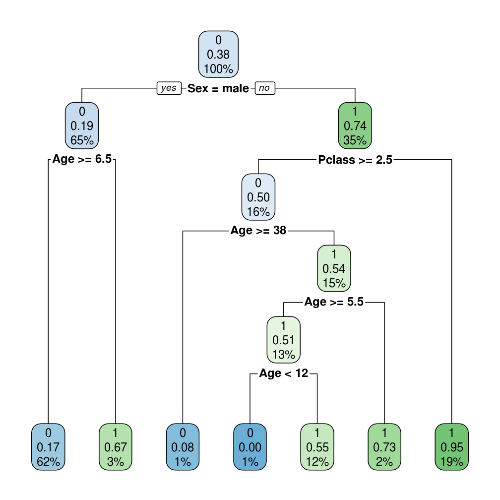

## Aprendizado Estatístico

O termos *Aprendizado Estatístico* refere-se a uma vasta quantidade de ferramentas
que são utilizadas para entender dados. Essas ferramentas são classificadas em 
**supervisionadas** e **não-supervisionadas**. De forma geral, aprendizado
supervisionado envolve a construção de um modelo estatístico para prever ou estimar
uma **resposta** de acordo com uma ou mais informações de entrada. No aprendizado 
não-supervisionado existem variáveis de entrada mas não existe uma variável resposta. 
Neste caso, o objetivo é entender a estrutura e a relação entre as variáveis. Existe
uma terceira classificação para as ferramentas de aprendizado estatístico chamada 
[Reinforcement Learning](https://en.wikipedia.org/wiki/Reinforcement_learning), mas
não abordaremos este tema neste material.

### Exemplos

1. Um estudo estatístico cujo objetivo é estimar a probabilidade de uma transação 
ser uma fraude e são fornecidos dados relativos a transações passadas bem como se 
estas foram uma fraude ou não. É considerado um estudo de aprendizado supervisionado.

2. Um estudo em que são fornecidas diversas informações sobre os hábitos de compras
dos clientes e deseja-se identificar diferentes segmentos, é um
estudo de aprendizado não-supervisionado.

---------

Neste material vamos abordar inicialmente algumas técnicas de aprendizado supervisionado.
Em seguida abordaremos superficialmente alguns conceitos de aprendizado 
não-supervisionado. Todos esses conceitos serão apresentados com exemplos práticos 
usando o R. 

Para se aprofundar mais no assunto os seguintes links são ótimas referências.

* [An Introduction to Statistical Learning](http://www-bcf.usc.edu/~gareth/ISL/ISLR%20Sixth%20Printing.pdf)
* [Coursera - Practical Machine Learning](https://www.coursera.org/learn/practical-machine-learning)


## Aprendizado Supervisionado

Suponha que você observou uma variável resposta $Y$ e $p$ diferentes variáveis 
explicativas $X_1, X_2, ..., X_p$. Assumimos que existe alguma relação entre $Y$
e $X = (X_1, X_2, ..., X_p)$. Podemos denotar matematicamente esta relação como
na seguinte equação:

$$Y = f(X) + \epsilon$$

O objetivo geral do aprendizado supervisionado é estimar a função $f$.
Nessa formulação, $\epsilon$ é um termo de erro aleatório com média 0. $f$ representa
a informação sistemática que $X$ fornece sobre $Y$.

Existem diversas maneiras de estimar essa função. Em alguns casos assumimos uma
forma paramétrica para ela, em outros não. Alguns exemplos de algoritmos são:

* Regressão Linear
* Regressão Logística
* Árvore de Decisão
* Florestas Aleatórias (*Random Forest*)
* Gradient Boosting
* Redes Neurais
* Etc.

Cada um dos algoritmos possui as suas vantagens e desvantagens, e problemas em 
que trazem melhores resultados ou não. 


## Regressão Linear

O modelo linear assume que a função $f$ é uma função linear de modo que a formulação
do apredizado supervisionado pode ser reescrita da seguinte forma:

$$Y = \alpha + X\beta + \epsilon$$
Em que $\alpha$ e $\beta$ são coeficientes que serão estimados. Esses valores são 
calculados de forma a minimizar uma **função de perda** na sua amostra. A função 
mais utilizada é a perda quadrática na sua amostra. Considere $(y_1, x_1)$, $(y_2, x_2)$, ..., $(y_n, x_n)$ uma amostra de tamanho $n$.

$\alpha$ e $\beta$ são escolhidos de tal forma que:

$$\sum_{i = 1}^{n} [y_i - (\alpha + \beta x_i)]^2$$
seja o menor possível. Isto é, estamos minimizando o *erro quadrático*.

Na ótica da estatística, assumimos também que $Y \sim Normal(\alpha + X \beta, \sigma^2)$, 
escolhemos $\alpha$ e $\beta$ de forma que maximize uma função que chamamos de [verossimilhança](https://pt.wikipedia.org/wiki/Fun%C3%A7%C3%A3o_de_verossimilhan%C3%A7a). 
Essa suposição é útil quando queremos fazer testes de hipóteses e intervalos de 
confiança. Por enquanto, não estamos interessados nisso e portanto vamos 
apresentar uma visão menos complexa.

### Exemplo

Considere o banco de dados *BodyFat* obtido [aqui](http://www2.stetson.edu/~jrasp/data.htm). 
Esses são dados do percentual de gordura corporal em uma amostra de 252 homens junto com
diversas outras medidas corporais. O percentual de gordura corporal é medido pesando
a pessoa sob a água, um procedimento trabalhoso. O objetivo é fazer um modelo linear
que permita obter o percentual de gordura usando medidas do corpo fáceis de serem obtidas.
Os dados são do site do Journal of Statistics Education.


```r
library(readxl)
library(dplyr)
library(ggplot2)
bodyfat <- read_excel('data/BodyFat.xls')
```


```r
ggplot(bodyfat, aes(x = WEIGHT, y = BODYFAT)) + geom_point()
```


A partir do gráfico de dispersão, vemos que o peso do indivíduo parece ser **linearmente**
relacionado ao percentual de gordura corporal. Vamos então ajustar um modelo linear
usando o R. Para ajustar o modelo, usamos a função `lm` (de *__l__inear __m__odel*). 
A função `lm`, assim como muitas outras que ajustam modelo no R, recebe como argumentos
uma formula e um banco de dados. 

`formula` é um tipo especial de objeto no R que ajuda muito na especificação dos modelos. 
Ela tem a forma `y ~ x1 + x2 + ... + xn` em que `y` é o nome da variável resposta e `x1`,
`x2`, ..., `xn` são os nomes das variáveis que serão utilizadas como explicativas. 


```r
ajuste <- lm(BODYFAT ~ WEIGHT, data = bodyfat)
```

Com essa chamada da função criamos o objeto `ajuste`. Esse objeto abriga informações
relacionadas ao ajuste do modelo.

$$bodyfat = \alpha + \beta*weight + \epsilon$$
As estimativas de $\alpha$ e $\beta$ podem ser encontradas usando a função `summary`.
A estimativa de $\alpha$ é o valor da coluna `Estimate` na linha `(Intercept)`: -9.99515 
e a estimativa de $\beta$ é o valor logo abaixo: 0.16171.


```r
summary(ajuste)
## 
## Call:
## lm(formula = BODYFAT ~ WEIGHT, data = bodyfat)
## 
## Residuals:
##     Min      1Q  Median      3Q     Max 
## -16.434  -4.315   0.079   4.540  19.681 
## 
## Coefficients:
##             Estimate Std. Error t value Pr(>|t|)    
## (Intercept) -9.99515    2.38906  -4.184 3.97e-05 ***
## WEIGHT       0.16171    0.01318  12.273  < 2e-16 ***
## ---
## Signif. codes:  0 '***' 0.001 '**' 0.01 '*' 0.05 '.' 0.1 ' ' 1
## 
## Residual standard error: 6.135 on 250 degrees of freedom
## Multiple R-squared:  0.376,	Adjusted R-squared:  0.3735 
## F-statistic: 150.6 on 1 and 250 DF,  p-value: < 2.2e-16
```

Em R, o ajuste de um modelo estatístico é salvo em um objeto. Esse objeto é uma
`list` que armazena diversas informações sobre o ajuste. Você pode ver algumas
informações disponíveis quando vê a estrutura do objeto `ajuste` usando a função 
`str`.


```r
str(ajuste, max.level = 1)
## List of 12
##  $ coefficients : Named num [1:2] -9.995 0.162
##   ..- attr(*, "names")= chr [1:2] "(Intercept)" "WEIGHT"
##  $ residuals    : Named num [1:252] -2.35 -11.12 9.69 -8.98 8 ...
##   ..- attr(*, "names")= chr [1:252] "1" "2" "3" "4" ...
##  $ effects      : Named num [1:252] -300.64 75.29 10.38 -9.01 7.98 ...
##   ..- attr(*, "names")= chr [1:252] "(Intercept)" "WEIGHT" "" "" ...
##  $ rank         : int 2
##  $ fitted.values: Named num [1:252] 14.9 18 14.9 19.9 19.8 ...
##   ..- attr(*, "names")= chr [1:252] "1" "2" "3" "4" ...
##  $ assign       : int [1:2] 0 1
##  $ qr           :List of 5
##   ..- attr(*, "class")= chr "qr"
##  $ df.residual  : int 250
##  $ xlevels      : Named list()
##  $ call         : language lm(formula = BODYFAT ~ WEIGHT, data = bodyfat)
##  $ terms        :Classes 'terms', 'formula'  language BODYFAT ~ WEIGHT
##   .. ..- attr(*, "variables")= language list(BODYFAT, WEIGHT)
##   .. ..- attr(*, "factors")= int [1:2, 1] 0 1
##   .. .. ..- attr(*, "dimnames")=List of 2
##   .. ..- attr(*, "term.labels")= chr "WEIGHT"
##   .. ..- attr(*, "order")= int 1
##   .. ..- attr(*, "intercept")= int 1
##   .. ..- attr(*, "response")= int 1
##   .. ..- attr(*, ".Environment")=<environment: 0x39ddf40> 
##   .. ..- attr(*, "predvars")= language list(BODYFAT, WEIGHT)
##   .. ..- attr(*, "dataClasses")= Named chr [1:2] "numeric" "numeric"
##   .. .. ..- attr(*, "names")= chr [1:2] "BODYFAT" "WEIGHT"
##  $ model        :'data.frame':	252 obs. of  2 variables:
##   ..- attr(*, "terms")=Classes 'terms', 'formula'  language BODYFAT ~ WEIGHT
##   .. .. ..- attr(*, "variables")= language list(BODYFAT, WEIGHT)
##   .. .. ..- attr(*, "factors")= int [1:2, 1] 0 1
##   .. .. .. ..- attr(*, "dimnames")=List of 2
##   .. .. ..- attr(*, "term.labels")= chr "WEIGHT"
##   .. .. ..- attr(*, "order")= int 1
##   .. .. ..- attr(*, "intercept")= int 1
##   .. .. ..- attr(*, "response")= int 1
##   .. .. ..- attr(*, ".Environment")=<environment: 0x39ddf40> 
##   .. .. ..- attr(*, "predvars")= language list(BODYFAT, WEIGHT)
##   .. .. ..- attr(*, "dataClasses")= Named chr [1:2] "numeric" "numeric"
##   .. .. .. ..- attr(*, "names")= chr [1:2] "BODYFAT" "WEIGHT"
##  - attr(*, "class")= chr "lm"
```

Por exemplo você pode acessar os coeficientes do modelo usando `ajuste$coefficients`.

Outra função que existe para a maior parte dos modelos que podem ser ajustados usando o R 
a `predict`. Usamos a função `predict` para obter as estimativas do modelo ajustado para
uma base de dados (nova ou não).


```r
bodyfat$predito_modelo1 <- predict(ajuste, newdata = bodyfat)
bodyfat %>% select(WEIGHT, BODYFAT, predito_modelo1) %>% head() %>% knitr::kable()
```


| WEIGHT| BODYFAT| predito_modelo1|
|------:|-------:|---------------:|
| 154.25|    12.6|        14.94842|
| 173.25|     6.9|        18.02089|
| 154.00|    24.6|        14.90800|
| 184.75|    10.9|        19.88054|
| 184.25|    27.8|        19.79969|
| 210.25|    20.6|        24.00412|

Nessa tabela, vemos o valor predito pelo modelo para cada observação bem como o
valor verdadeiro de gordura corporal daquele indivíduo. Nosso modelo não parece
estar muito bom. Uma possível medida de erro é o MSE (Erro quadrático médio).
Podemos calculá-lo fazendo contas simples no R.


```r
mse <- mean((bodyfat$BODYFAT - bodyfat$predito_modelo1)^2)
mse
## [1] 37.34089
```

É mais fácil identificar se esse erro é baixo ou não comparando-o com o erro se 
usássemos a média da variável como valor predito para todas as observações e 
tirando a raíz quadrada dos dois.


```r
erro_usando_media <- mean((bodyfat$BODYFAT - mean(bodyfat$BODYFAT))^2)
erro_usando_media
## [1] 59.83737

sqrt(mse)
## [1] 6.110719
sqrt(erro_usando_media)
## [1] 7.735462
```

Agora podemos ter uma ideia de que o nosso erro está alto. Se usássemos apenas a 
média erraríamos em média 7,7 usando o nosso modelo, ficamos com 6,1.

Felizmente, podemos melhorar o modelo adicionando mais variáveis. No R basta:


```r
ajuste2 <- lm(BODYFAT ~ WEIGHT + HEIGHT + CHEST + ABDOMEN + NECK + KNEE, 
              data = bodyfat)
```

O erro pode ser novamente calculado repetindo as operações que fizemos anteriormente.


```r
bodyfat$predito_modelo2 <- predict(ajuste2, newdata = bodyfat)
mse <- mean((bodyfat$BODYFAT - bodyfat$predito_modelo2)^2)
sqrt(mse)
## [1] 4.049453
```

Agora reduzimos bastante o erro. É muito importante ressaltar que estamos avaliando
o erro dentro da mesma base de dados que utilizamos para ajustar o modelo. Isso é 
considerado uma má prática, pois podemos facilmente esbarrar em uma situação de
*superajuste* ou *overfitting*.


## Árvore  de Decisão

Os modelos de árvore de decisão como vamos utilizar são implementados de acordo
com o livro *Classification and Regression Trees* de Breiman, Friedman, Olshen e Stone.
No R, o pacote que usamos para fazer este tipo de análise é o `rpart`. Uma 
curiosidade é que gostariam que os autores do pacote gostariam de usar o nome `cart`,
mas esse nome foi utilizado por uma implementação particular dessas ideias. No fim,
ficou mais famoso o `rpart`, mostrando a importância do software livre.

Não vamos entrar matematicamente no detalhe de como funciona uma árvore de decisão.
Para entender como funciona um árvore de decisão, imagine que você tem um nó com
$N$ observações e que $n$ possuem $Resposta = 1$ e $N - n$ possuem $Resposta = 0$, 
ou seja, temos um problema de classificação binária. Então neste caso $p = \frac{n}{N}$
é a proporção de resposta neste nó.

O objetivo da árvore de decisão dividir este nó em 2 de forma que a diferença entre
a proporção de respostas entre os dois nós resultantes seja a maior possível. Claro que 
cada um dos nós precisa ter uma quantidade significativa de observações de forma que $p$ 
seja estimado corretamente.

Uma introdução mais formal a esses métodos pode ser encontrada na vignette do pacote 
`rpart`. Digite `vignette('longintro', package = 'rpart')` no console para encontrá-la.

### Exemplo 

Para esse exemplo vamos usar o banco de dados do Titanic. Um banco de dados que
ficou famoso por causa de uma competição no Kaggle. Esse banco de dados contém 
diversas informações sobre os passageiros do Titanic bem como uma variável que 
indica se o passageiro sobreviveu (1) e se não sobreviveu (0).


```r
library(readr)
titanic <- read_csv('data/titanic-train.csv')
## Parsed with column specification:
## cols(
##   PassengerId = col_integer(),
##   Survived = col_integer(),
##   Pclass = col_integer(),
##   Name = col_character(),
##   Sex = col_character(),
##   Age = col_double(),
##   SibSp = col_integer(),
##   Parch = col_integer(),
##   Ticket = col_character(),
##   Fare = col_double(),
##   Cabin = col_character(),
##   Embarked = col_character()
## )
titanic$Survived <- as.factor(titanic$Survived)
```

Usando o `rpart` podemos ajustar o modelo de árvore de cdecisão fazendo.
A função `rpart` recebe uma fórmula indicando a variável resposta e as 
variáveis que serão utilizadas no modelo, além de receber um argumento
`data` que indica o banco de dados utilizado.


```r
library(rpart)
arvore <- rpart(Survived ~ Sex + Age + Pclass, data = titanic)
```

Assim como na regressão linear, podemos ver informações sobre o ajuste
usando a função `summary`.


```r
summary(arvore)
## Call:
## rpart(formula = Survived ~ Sex + Age + Pclass, data = titanic)
##   n= 891 
## 
##           CP nsplit rel error    xerror       xstd
## 1 0.44444444      0 1.0000000 1.0000000 0.04244576
## 2 0.02339181      1 0.5555556 0.5555556 0.03574957
## 3 0.01461988      2 0.5321637 0.5935673 0.03660811
## 4 0.01169591      4 0.5029240 0.5672515 0.03602071
## 5 0.01000000      6 0.4795322 0.5321637 0.03518794
## 
## Variable importance
##    Sex Pclass    Age 
##     70     18     12 
## 
## Node number 1: 891 observations,    complexity param=0.4444444
##   predicted class=0  expected loss=0.3838384  P(node) =1
##     class counts:   549   342
##    probabilities: 0.616 0.384 
##   left son=2 (577 obs) right son=3 (314 obs)
##   Primary splits:
##       Sex    splits as  RL,       improve=124.426300, (0 missing)
##       Pclass < 2.5  to the right, improve= 43.781830, (0 missing)
##       Age    < 6.5  to the right, improve=  8.814172, (177 missing)
## 
## Node number 2: 577 observations,    complexity param=0.02339181
##   predicted class=0  expected loss=0.1889081  P(node) =0.647587
##     class counts:   468   109
##    probabilities: 0.811 0.189 
##   left son=4 (553 obs) right son=5 (24 obs)
##   Primary splits:
##       Age    < 6.5  to the right, improve=10.78893, (124 missing)
##       Pclass < 1.5  to the right, improve=10.01914, (0 missing)
## 
## Node number 3: 314 observations,    complexity param=0.01461988
##   predicted class=1  expected loss=0.2579618  P(node) =0.352413
##     class counts:    81   233
##    probabilities: 0.258 0.742 
##   left son=6 (144 obs) right son=7 (170 obs)
##   Primary splits:
##       Pclass < 2.5  to the right, improve=31.163130, (0 missing)
##       Age    < 12   to the left,  improve= 1.891684, (53 missing)
##   Surrogate splits:
##       Age < 18.5 to the left,  agree=0.564, adj=0.049, (0 split)
## 
## Node number 4: 553 observations
##   predicted class=0  expected loss=0.1681736  P(node) =0.620651
##     class counts:   460    93
##    probabilities: 0.832 0.168 
## 
## Node number 5: 24 observations
##   predicted class=1  expected loss=0.3333333  P(node) =0.02693603
##     class counts:     8    16
##    probabilities: 0.333 0.667 
## 
## Node number 6: 144 observations,    complexity param=0.01461988
##   predicted class=0  expected loss=0.5  P(node) =0.1616162
##     class counts:    72    72
##    probabilities: 0.500 0.500 
##   left son=12 (12 obs) right son=13 (132 obs)
##   Primary splits:
##       Age < 38.5 to the right, improve=3.875163, (42 missing)
## 
## Node number 7: 170 observations
##   predicted class=1  expected loss=0.05294118  P(node) =0.1907969
##     class counts:     9   161
##    probabilities: 0.053 0.947 
## 
## Node number 12: 12 observations
##   predicted class=0  expected loss=0.08333333  P(node) =0.01346801
##     class counts:    11     1
##    probabilities: 0.917 0.083 
## 
## Node number 13: 132 observations,    complexity param=0.01169591
##   predicted class=1  expected loss=0.4621212  P(node) =0.1481481
##     class counts:    61    71
##    probabilities: 0.462 0.538 
##   left son=26 (117 obs) right son=27 (15 obs)
##   Primary splits:
##       Age < 5.5  to the right, improve=1.777778, (42 missing)
## 
## Node number 26: 117 observations,    complexity param=0.01169591
##   predicted class=1  expected loss=0.4871795  P(node) =0.1313131
##     class counts:    57    60
##    probabilities: 0.487 0.513 
##   left son=52 (8 obs) right son=53 (109 obs)
##   Primary splits:
##       Age < 12   to the left,  improve=3.900498, (42 missing)
## 
## Node number 27: 15 observations
##   predicted class=1  expected loss=0.2666667  P(node) =0.01683502
##     class counts:     4    11
##    probabilities: 0.267 0.733 
## 
## Node number 52: 8 observations
##   predicted class=0  expected loss=0  P(node) =0.008978676
##     class counts:     8     0
##    probabilities: 1.000 0.000 
## 
## Node number 53: 109 observations
##   predicted class=1  expected loss=0.4495413  P(node) =0.1223345
##     class counts:    49    60
##    probabilities: 0.450 0.550
```

Visualizar a árvore de decisão sempre dá bons *insights*. Um pacote que é interessante
para visualizar a árvore de decisão construída com o `rpart` é o `rpart.plot`. 


```r
library(rpart.plot)
rpart.plot(arvore)
```



A visualização é bem intuitiva. No topo, vemos o primeiro nó em que 38% dos indivíduos
sobreviveram e que representa o total da base (100%). Em seguida, vemos que a primeira
variável que discrimina quem sobreviveu ou não é a variável Sexo: Dos homens, que eram 65%
dos passageiros, apenas 19% sobreviveu enquanto das mulheres, que eram 35%, 74% sobreviveu.
Dos homens, aqueles que eram menores de 6 anos e meio, sobreviveram em maior proporção
também. A interpretação pode continuar dessa forma recursivamente.

Mais uma vez, assim como na regressão linear, podemos utilizar a função `predict` para 
obter a probabilidade predita de sobrevivência e a classificação predita para cada
observação. A diferença é que agora temos o parâmetros `type`, que vai indicar se queremos
a probabilidade ou a classe predita.


```r
probabilidades <- predict(arvore, newdata = titanic, type = 'prob')
```

Com `type = 'prob'` obtemos uma `matrix` em que cada coluna representa a probabilidade
predita para cada classe. Quando temos apenas um classe isso pode parecer desnecessário
já que o valor de uma coluna é a diferença de 1 pelo valor da outra, mas árvores podem 
ser utilizadas em modelos com mais de classificação para mais de duas categorias.


```r
classes <- predict(arvore, newdata = titanic, type = 'class')
```

Quando você prevê a classe diretamente, o `rpart` indica como predito quando a
probabilidade de sobrevivência é maior do que 50%. Isso nem sempre é o que garante
o maior ganho com o modelo. Principalmente em problemas em que as classes são muito
desbalanceadas. Além disso, em outros problemas, os custos de classificar uma observação
como positiva quando ela é negativa, podem ser diferentes de classificá-la como negativa
quando ela é positiva.

Para escolher o melhor ponto de corte da probabilidade, podemos usar a curva ROC, e
uma função de custo. Existem diversos pacotes que ajudam a calcular essas medidas. Vamos fazer aqui sem usá-los para praticar.


```r
library(tidyverse)
## Loading tidyverse: tibble
## Loading tidyverse: tidyr
## Loading tidyverse: purrr
## Conflicts with tidy packages ----------------------------------------------
## filter(): dplyr, stats
## lag():    dplyr, stats
cortes <- seq(0,1,by = 0.01)
valores <- map_df(cortes, function(x){
  tabela <- table(
    titanic$Survived, 
    factor(probabilidades[,2] > x, levels = c("FALSE", "TRUE"))
    )
  data_frame(
    corte = x,
    FPR = tabela[1,2]/sum(tabela[1,]),
    TPR = tabela[2,2]/sum(tabela[2,]),
    TNR = tabela[1,1]/sum(tabela[1,]),
    FNR = tabela[2,1]/sum(tabela[2,])
  )
})


ggplot(valores, aes(x = FPR, y = TPR)) + 
  geom_step() + 
  geom_abline(color = 'blue', linetype = 'dashed')
```


A função de custo pode ser calculada da seguinte forma. Veja que estamos considerando
pesos iguais para ambos os erros.


```r
valores %>%
  mutate(custo = FPR + FNR) %>%
  ggplot(aes(x = corte, y = custo)) +
  geom_line()
```


Neste caso, o ponto mínimo da função é obtido com qualquer corte entre um pouco menos de 25%
até um pouco mais de 50%. Isso nem sempre é verdade e deve ser avaliado em cada modelo.


<script src="https://cdn.datacamp.com/datacamp-light-latest.min.js"></script>


<script src="https://cdn.datacamp.com/datacamp-light-latest.min.js"></script>


1. Calcule o número de ouro no R.

$$
\frac{1 + \sqrt{5}}{2}
$$

<div data-datacamp-exercise data-height="300" data-encoded="true">eyJsYW5ndWFnZSI6InIiLCJzYW1wbGUiOiIjIERpZ2l0ZSBhIGV4cHJlc3NcdTAwZTNvIHF1ZSBjYWxjdWxhIG8gblx1MDBmYW1lcm8gZGUgb3Vyby4iLCJzb2x1dGlvbiI6IigxICsgc3FydCg1KSkvMiIsInNjdCI6InRlc3Rfb3V0cHV0X2NvbnRhaW5zKFwiMS42MTgwMzRcIiwgaW5jb3JyZWN0X21zZyA9IFwiVGVtIGNlcnRlemEgZGUgcXVlIGluZGljb3UgYSBleHByZXNzXHUwMGUzbyBjb3JyZXRhbWVudGU/XCIpXG5zdWNjZXNzX21zZyhcIkNvcnJldG8hXCIpIn0=</div>


